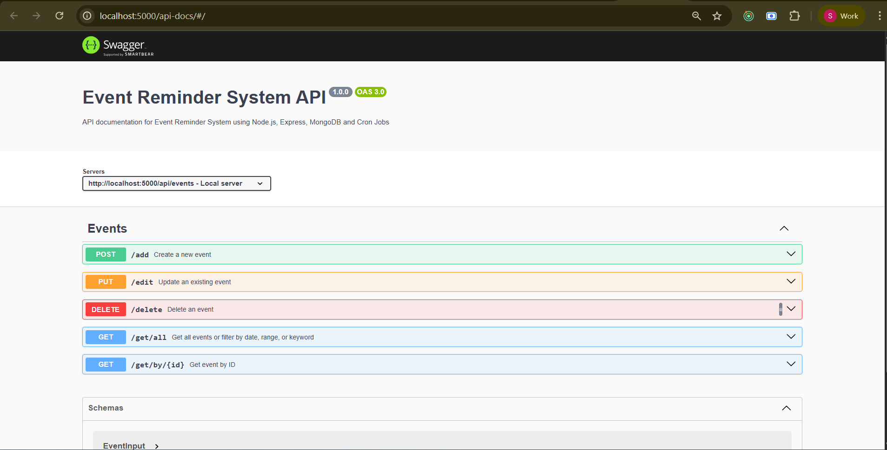

# 📅 Event Reminder System using Cron Jobs

A full-featured Node.js application that enables users to schedule, manage, and receive reminders for upcoming events using automated cron jobs. The system features RESTful APIs, MongoDB for persistent storage, an Express.js backend, cron-based automation, Swagger documentation, and robust security middleware.

---

## 🚀 Features

- ✅ Create, edit, and delete events
- 📬 Automated email reminders via cron jobs
- 🔍 Filter events by date, range, or keyword search
- 🔐 Input validation with `express-validator`
- 📦 Interactive API documentation at `/api-docs` (Swagger UI)
- 🧰 Secure, production-ready middleware
- 📆 Event storage powered by MongoDB & Mongoose

---

**Default Endpoints:**

- 📍 [Health Check](http://localhost:5000/ok)
- 📘 [Swagger API Docs](http://localhost:5000/api-docs)

